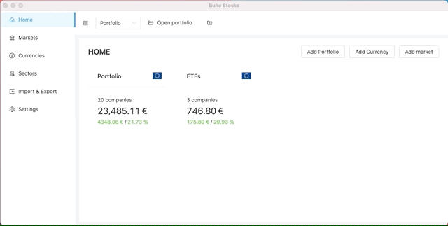

# Buho-Stocks

<p align="center"></p>

<p align="center">Multi platform (and offline) desktop application to manage and track a stocks portfolio with dividends and return for a <a href="https://en.wikipedia.org/wiki/Buy_and_hold" title="Wikipedia">Buy & Hold investment</a> investment strategy.</p>
<p align="center">

<a href="https://codecov.io/gh/bocabitlabs/buho-stocks" title="CodeCov"></a>
</p>

<p align="center">
  <a href="#features">Features</a> •
  <a href="#install">Install</a> •
  <a href="#development">Development</a> •
  <a href="#links">Links</a> •
  <a href="#attributions">Attributions</a>
</p>

<hr/>

<p align="center"></p>

## 🎁 Features

| Feature  | Description  |
|---|---|
| Unlimited portfolios  |   |
| Unlimited companies per portfolio  |   |
| Support for stock transactions, dividends and rights | |
| Unlimited currencies | |
| Unlimited sectors and subsectors | |
| Historical Exchange rates from ECB | |
| Import CSV files from Interactive Brokers and ING (Spain) | |
| Export data to CSV | |
| Fetch stock prices and exchange rates from a external source in real time. |
| Multiple charts: dividends, returns, sectors, currencies... | |
| Database backup | |

- Planned: Support for multiple languages


## 🔧 Install

> ⬇️ New versions are published on the [Releases Page](https://github.com/bocabitlabs/buho-stocks/releases).

You can download them from there and run them on your system.

Please, be aware that since I'm developing it on Mac OS X (Currently Big Sur) this is the only "really tested" environment.

## 🧑‍💻 Development

### Technologies used

- React
- Electron
- Typescript
- Ant Design (UI)

### Dev. Requirements

- Node 13
- Yarn 1.22

### How to contribute

If you want to participate on the project, please take a look at
the [CONTRIBUTING file](/docs/CONTRIBUTING.md) as it includes information about the branching and commit guideliness.

##### 1. Install dependencies

###### Mac OS X

```bash
brew install node && brew install yarn
```

##### 2. Install the node dependencies

```bash
yarn
```

##### 3. Configure the application settings

> Only required if the application will be distributed on Github.

```bash
cp src/utils/config.sample.tsx src/utils/config.tsx
```

##### 4. Start the application

```bash
yarn dev
```

##### Testing

```bash
yarn test
```

##### Publishing

```bash
yarn publish
```

## 🛣 Paths

- Application's data (Mac): `~/Library/Application Support/buho-stocks`
- Logs (Mac): `~/Library/Logs/Buho-Stocks/main.log`

## 🔗 Links

- UI docs: https://ant.design/components/overview/
- ECB: https://sdw.ecb.europa.eu/quickview.do?SERIES_KEY=120.EXR.D.CHF.EUR.SP00.A
- Graphs: https://nivo.rocks/

## 🙏 Attributions

- Icons by [lavarmsg](https://www.vecteezy.com/members/lavarmsg)

## 📝 License

[GPL 3](LICENSE)

All 3rd party logos are property of their owners.

